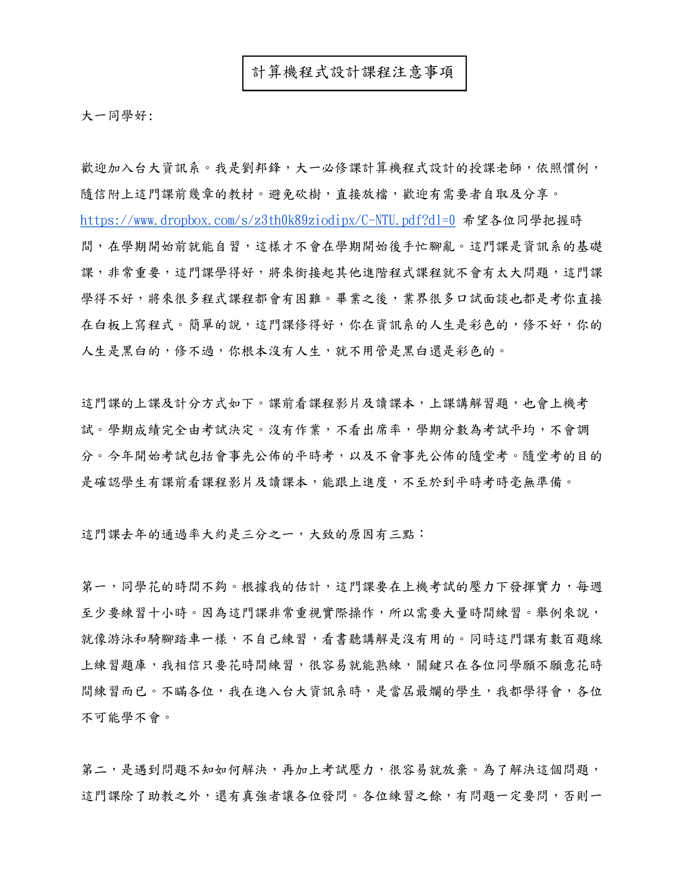
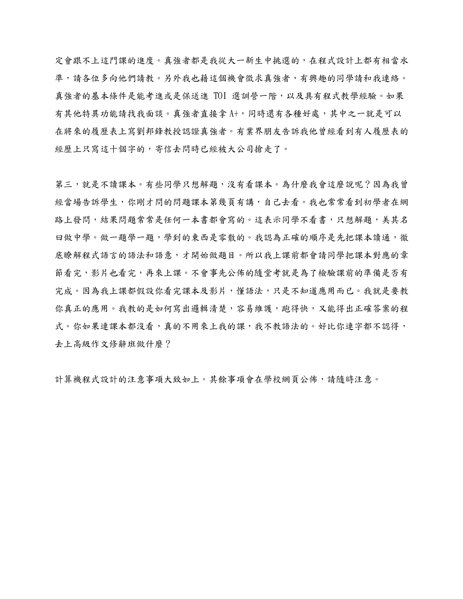

## 開學前兩週的小故事

這門課對我來說比較特別，理論上不會有上課筆記，取而代之的是隔週考的題解。為何事情會變成這樣，得從開學第一天發生的事開始說起呢。

### 通往真強者之路

大學生活的第一堂課，也就是開學第一天的早9到中午，就得面臨「傳說中去年只過1/3」的邦邦計程，這未免也太刺激了。

其實在開學前，我和幾位同學就對這門課的真面目略有聽聞，消息來源除了口耳相傳之外，不外乎就是隨著給新生的信一同寄來的「大一計算機程式設計課程注意事項」。

> 真強者都是我從大一新生中挑選的，在程式設計上都有相當水準，請各位多向他們請教。另外我也藉這個機會徵求真強者，有興趣的同學請和我連絡。**真強者的基本條件是能考進或是保送進 TOI 選訓營一階，以及具有程式教學經驗。如果有其他特異功能請找我面談。真強者直接拿A+**，同時還有各種好處，其中之一就是可以在將來的履歷表上寫劉邦鋒教授認證真強者。有業界朋友告訴我他曾經看到有人履歷表的經歷上只寫這十個字的，寄信去問時已經被大公司搶走了。

「程式教學經驗我是有啦，不過『能考進或是保送進TOI選訓營一階』門檻也太高了吧......我看還是算了吧😅。」

讀完這封信後，我是這麼想的。儘管在北小迎時有位學長鼓勵我「我覺得就寄信看看啊，反正沒通過也不會怎樣」，我還是沒有踏出那一步。

時間回到開學第一天，一股冰冷的氛圍充斥著德田館204教室內。一間幾乎滿座的電腦教室，3個小時的上課時間，除了時不時就會斷線的麥克風收到的授課聲，以及台下同學們偶爾的竊竊私語或害羞的回答之外，就只剩下空調與電腦風扇的雜音了。坦白說，前一天才搬進宿舍的我正適應著新的生活環境，同時身上背負著作息爆炸的debuff，導致我從第3、4節就一直打瞌睡😥。

好不容易撐到了第4節下課，我準備離開教室趕去覓食，卻發現我的一位朋友卻站在原地不動，若有所思地看向教授所在的講台方向。

「我想去問現在還能不能應徵真強者欸，你覺得呢？」

「呃......我想說還是算了。」

這下我們兩人都愣在原地了。但我並不是在思考自己要不要去找教授，反而是在等待我朋友的下一步會是進或退。正當我以為他會選擇轉身離開教室時，他卻頭也不回地快步走向教授前方，害我只能在驚訝的同時急忙跟在他身後。

和教授的對話我就不詳述了吧。很榮幸的是，憑著我那自愧弗如的競賽與檢定經歷的其中一項，仍是獲得了教授的認可，成了21名真強者中的最後一名。

沉浸在突如其來的喜悅以及些許的受寵若驚之中，我踏著輕快的步伐走出教室。

「跟你說機會要自己爭取吧！」

「感謝你在開學第一天就為我上了這麼有道理的一課！」

所以結論是，我避開了每兩週一次的考試，取而代之的卻是一份工作：在大家考試前幫忙驗題。真沒想到還是會跟大家寫一樣的題目呢！不過沒有成績壓力真的是超級大的福利。

順帶一提，我朋友事後寄了資料給教授，也被收編為真強者了，真是可喜可賀🎉。

### 從驗題到寫題解

9/8(五)晚間，我花了55分鐘左右驗完了第一次考試的全部6題。在整理AC code的同時，一股衝勁突然湧上心頭。

「與其只把程式碼丟到GitHub，不如也來寫個題解好了！反正我也滿喜歡編講義的。」

於是，我又自己給自己加了一份工作：每次驗完題後寫題解。雖然我相信班上絕大多數的人都很電，應該永遠都不會用到詳解，但我就當作是自我滿足也還不賴吧。況且如果真的有想要看題解的人，也希望自己能幫到他們。

第一份詳解總算是在週一凌晨出爐了，但至少要等到週二下午的單數班也考完試後才能公布，而這段時間恰好可以讓我思考要以什麼樣的形式公布給大家。是私底下先傳給最好的朋友們，看看會被BFS轉傳到多少人呢？還是直接[在B12的Facebook社團發文](https://www.facebook.com/groups/ntucsieb12/posts/313117251262889/)？結果是我兩者都有做，但顯然是後者的效果比較顯著。

> 有鑑於之前沒有發到自介(😥)，第一句還是先來這個吧：大家好，我是B12的呂承諺。  
> 希望大家經歷(應該是)人生中第一次在批改娘上的考試後，並沒有跟隨前人的腳步，在204教室的牆上留下傷心欲絕的痕跡。雖然這次是第一次考試，題目相對簡單，理論上比較不會有心態炸裂或是想半天仍然沒頭緒的問題，我想說我既然都寫了題解，還是跟大家分享吧！希望能幫助到有需要的人。  
> https://github.com/gpwaob92679/JudgeGirl-solution/tree/main/C2023%20For%20Strong/Quiz%201/README.md  
> 之後如果時間允許，應該還會繼續寫下去。如果有錯誤或寫得不好的地方，還請各位不吝指教！

如同貼文中所說的，期許之後每隔週都能端出熱騰騰的詳解吧。

— 2023/09/16 01:59

## 題解

題解和AC code會整理在[JudgeGirl-solution](https://github.com/gpwaob92679/JudgeGirl-solution)這個repository，裡面其實也有其他練習題的參考AC code，有興趣的人可以去逛逛。

- [Quiz 1](https://github.com/gpwaob92679/JudgeGirl-solution/tree/main/C2023%20For%20Strong/Quiz%201)
