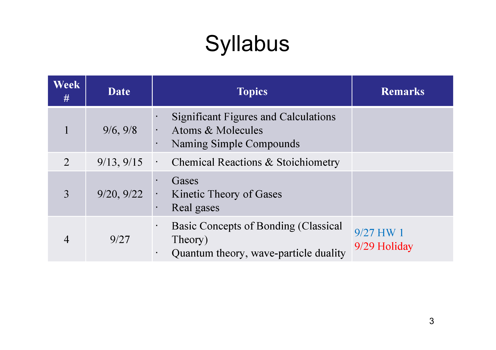
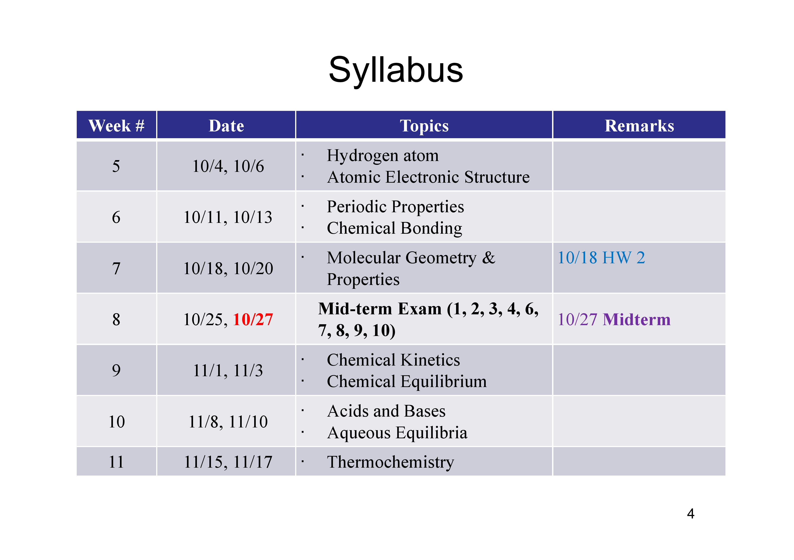
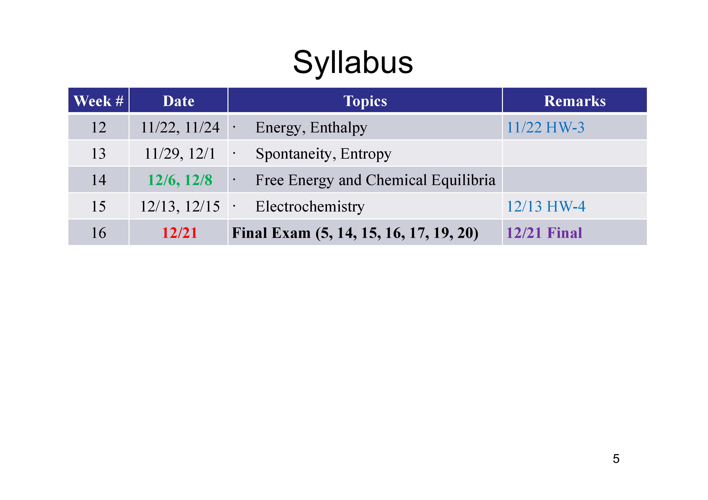
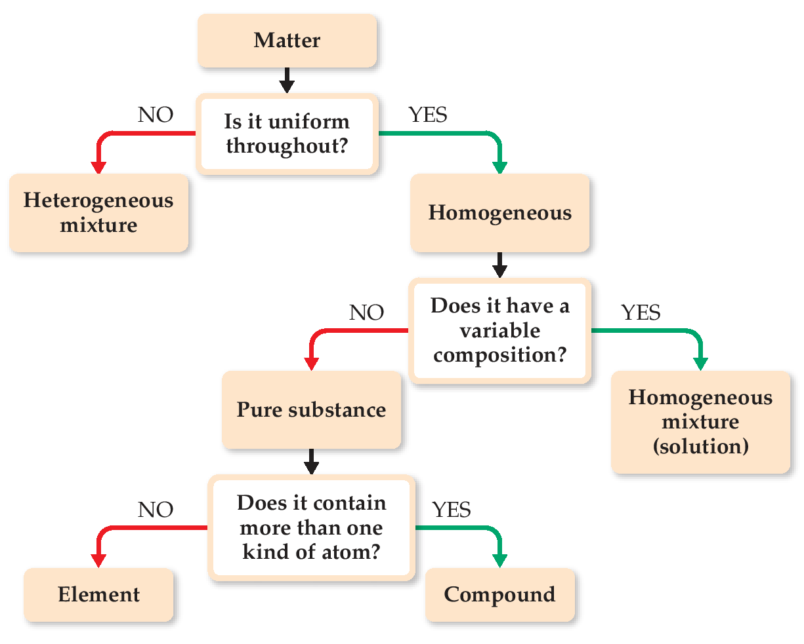
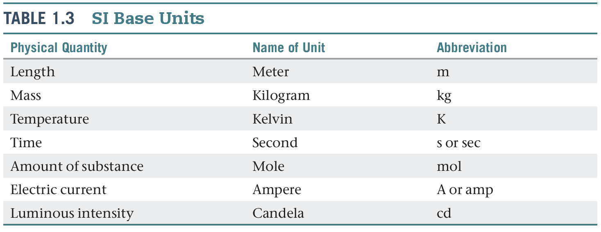
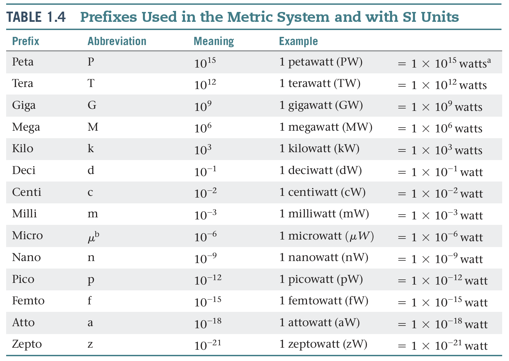
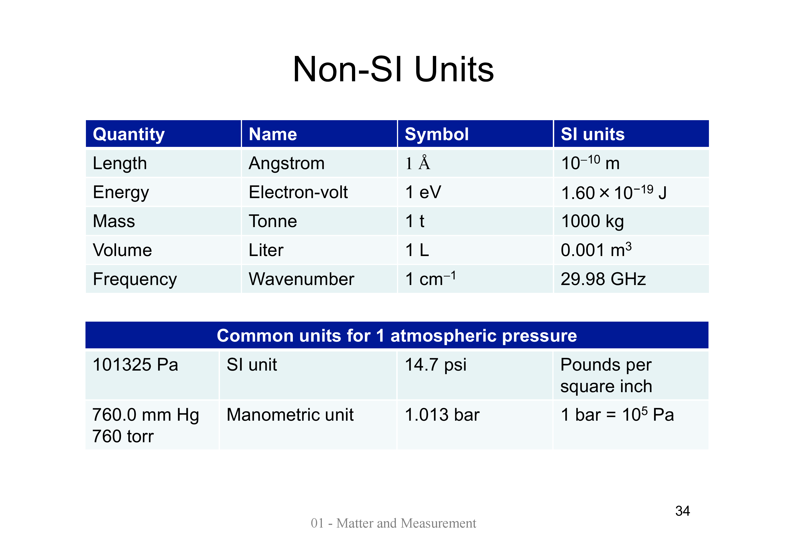
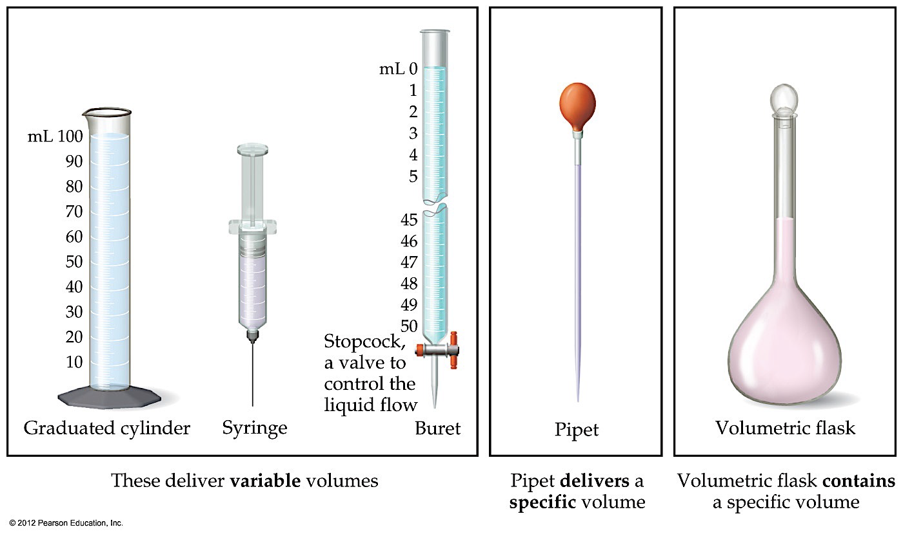
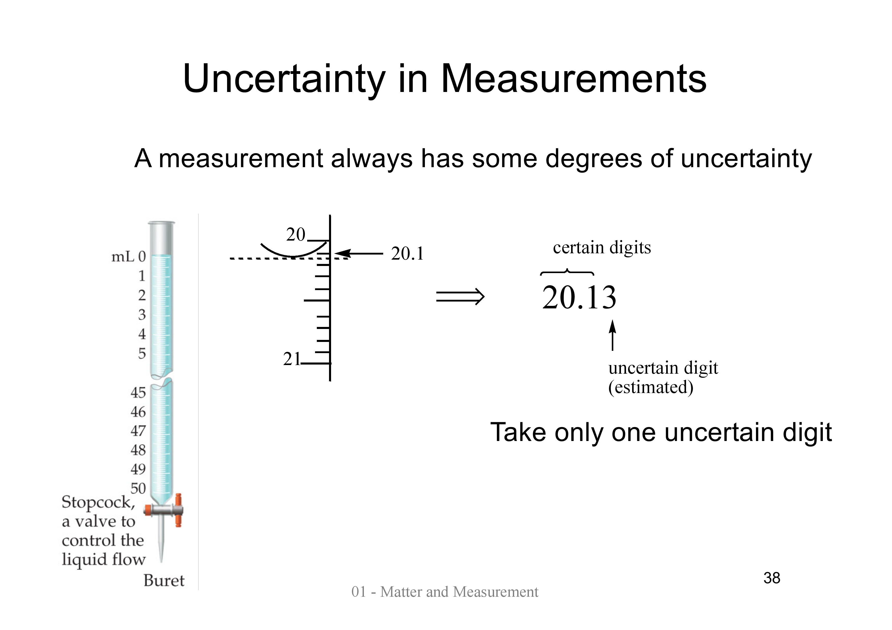

## General Information

### Instructor

邱靜雯 Ching-Wen Chiu cwchiu@ntu.edu.tw

### Time & Location

- 博雅教學館 202教室
- 週三3,4節(10:20-12:10)
- 週五3,4節(10:20-12:10)

TA hours：上課後一小時
- Wed 12:20-13:10
- Fri 12:20-13:10

### Textbook

Chemistry: The Central Science 14th Edition by Brown, LeMay, Bursten, Murphy, Woodward, Stoltzfus

### Grading
- Midterm 30% **2023/10/27**
- Final 30% **2023/12/21**
- Homework 20%
- Quiz 20%
<!---->
- 三班聯合教學、不調分

#### Quiz

- Quiz可能會在NTU COOL上，記得去考

#### Homework

- 四次作業，一次佔5%
- Homework due date：發布一週的**下課前(12:10)**
- 遲交一天扣該作業10% (x1→x0.9→x0.8→x0.7→...)
- 不接受打字，請手寫
- TA批改後會有評語跟講解

### Syllabus

  

> Syllabus更正
> 劉肇安 (LIU, CHAO-AN)
>
> To 各位同學:
> 關於第一份簡報的Syllabus，於此有幾處更正。
>
>（1）11/15（三）為校慶，11/24（五）為運動會，各停課一次。
>
>（2）期末考應為12/22（五）。
>
> By 助教群
>
> 發佈於：2023年9月8日 下午3:57

- 綠色為老師在國外，預計用Webex上課

## Chapter 1: Matter and Measurement

### 1.1: The Study of Chemistry

Chemistry is the study of the composition, structure, properties and changes of matter.

- **Matter**: Anything that has mass and occupies space by having volume.
- **Property**: Any characteristic that allows us to recognize a particular type of matter and to distinguish it from other types.
- **Element**: A chemical substance that cannot be broken down into other substances.
- **Atom**: The basic particle of the chemical elements.
- **Molecule**: Two or more atoms joined in specific shapes.

### 1.2: Classifications of Matter

#### States of Matter

- **Gas**
- **Liquid**
- **Solid**

#### Pure Substance

Matter that has distinct properties and a composition that does not vary from sample to sample, for example, water and sodium chloride.

- **Element**: A substance that cannot be decomposed into simpler substances; each element is composed of only one kind of atom.
- **Compound**: A substance composed of two or more elements; they contain two or more kinds of atoms.
- **Law of constant composition** (or law of definite proportions): a pure compound has the same composition and properties under the same conditions, no matter its source or method of preparation.

#### Mixture

A combination of two or more substances in which each substance retains its chemical identity.

- Homogeneous mixture: A mixture that is uniform throughout.
- Heterogeneous mixture: A mixture that isn't uniform throughout.

### 1.3: Properties of Matter

#### Properties

- Physical properties
  - Can observed without changing the identity and composition of the substance.
  - Examples: Color, odor, density, melting point, boiling point, and hardness.
- Chemical properties
  - The propensity of bond breaking and bond forming. (Thermodynamics 熱力學)
  - Rate of change. (Kinetics 動力學)
  - Example: Flammability.
<!-- -->
- Intensive properties
  - Do not depend on the amount of sample being examined.
  - Used to _identify_ substances.
- Extensive properties
  - Depend on the amount of sample.
  - Relate to the _amount_ of substance present.
  - Examples: Mass and volume.

#### Changes

- Physical change: A change in matter that do not change the composition of a substance.
  - All changes of state are physical changes.
- Chemical change (chemical reaction): A change that transform a substance into a chemically different substance.
  - Example: Combustion.

#### Separation of Mixtures

- Filtration
- Distillation
- Chromatography
- ...

### 1.5: Units of Measurement

#### SI Units

(Système international d'unités, international system of units)

- 7 base units
  
- Derived SI units
- Prefixes
  

#### Non-SI Units

#### Volume

### 1.6: Uncertainty in Measurement

Uncertainties always exist in measured quantities.

#### Precision versus Accuracy

- Precision (精確度): The proximity of several measurements to each other.
- Accuracy (準確度): The proximity of a measurement to the true value of a quantity.



#### Significant Figures (有效位數)

All digits of a measured quantity, including the uncertain one.

There is always some uncertainty in _the last digit_ reported for any measured quantity.

Rules:

1. In any measurement that is properly reported, _all nonzero digits_ are significant.
2. Zeros may or may not be significant:
   1. Zeros _between nonzero digits_ are _always_ significant.
   2. Zeros _at the beginning_ are _never_ significant (they merely indicate the position of the decimal point).
   3. Zeros _at the end_ are significant if the number _contains a decimal
point_. When a number ends with zeros but contains no decimal point, it is normally assumed that the zeros are not significant.
3. The exponential term does not add to the number of significant figures.

Examples:

| Rule | Number | Significant Figures |
|------|--------|---------------------|
| 2.1  | 1005   | 4                   |
|      | 2.01   | 3                   |
| 2.2  | 0.0073 | 2                   |
|      | 0.0200 | 3                   |
| 3.3  | 3.50   | 3                   |
|      | 2500.  | 4                   |
|      | 2500   | 2                   |

#### Significant Figures in Calculations

The least certain measurement limits the certainty of the calculated quantity and thereby determines the number of significant figures in the final answer.

Rules for arithmetic:

1. Addition and subtraction: The result has the same number of decimal places as the measurement with the _fewest decimal places_.
$$
\\begin{alignat*}{3}
         && 20.  & 4\textcolor{red}{2}  && \leftarrow\text{2 decimal places} \\\\
         && 1.   & 32\textcolor{red}{2} && \leftarrow\text{3 decimal places} \\\\
  +\quad && 83.  & \textcolor{red}{1}   && \leftarrow\text{1 decimal place} \\\\ \hline
         && 104. & \textcolor{red}{8}42 && \leftarrow\text{should be rounded off to 1 decimal place} \\\\
         && \Rightarrow 104. & \textcolor{red}{8}
\\end{alignat*}
$$
2. Multiplication and division: The result has the same number of significant figures as the measurement with the _fewest significant figures_.  
$6.23 \times \textcolor{red}{5.2} = \textcolor{red}{32}.396 \Rightarrow 32$
3. In base-10 logarithm of a normalized number ($a \times 10^n, 1 \leq a < 10, n \in \mathbb{N}$), the _mantissa_ (decimal part) has the same number of significant figures as the original normalized number.  
$\log(\textcolor{red}{9.57} \times 10^2)
 = 2 + \log \textcolor{red}{9.57}
 = 2 + 0.\textcolor{red}{980}91 \ldots
 = 2.\textcolor{red}{981}$  
$\text{antilog}(12.\textcolor{red}{54})
= \textcolor{red}{3.4}67\ldots \times 10^{12}
= \textcolor{red}{3.5} \times 10^{12}$

Rules for rounding off:
- If the leftmost digit discarded is less than 5, retain the last significant digit as is.  
  $7.24 \times 1.0 = 7.2$
- If the leftmost digit discarded is greater than or equal to 5, increase the last significant digit by 1.  
  $7.25 \times 1.0 = 7.3$

Exact numbers are assumed to have an infinite number of significant figures.

With reference to error estimation, rewrite the quantities in a more sensible way, for example:
- $\text{pH} = 9 \pm 0.01 \Rightarrow \text{pH} = 9.00 \pm 0.01$
- $0.0010386 \pm 0.00018 \ \text{g} \Rightarrow 1.04 \pm 0.18 \ \text{mg}$

### 1.7: Dimensional Analysis

**Conversion factor**: A fraction whose numerator and denominator are the same quantity expressed in different units. For example, $\frac{2.54\ \text{cm}}{1\ \text{in.}}$ and $\frac{1\ \text{in.}}{2.54\ \text{cm}}$.

$$\text{Given unit} \times \dfrac{\text{desired unit}}{\text{given unit}} = \text{desired unit}$$
